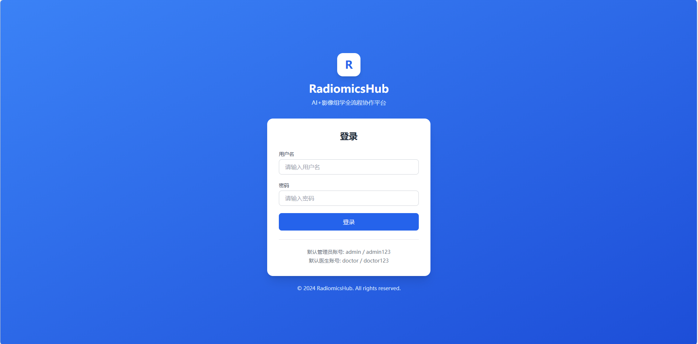
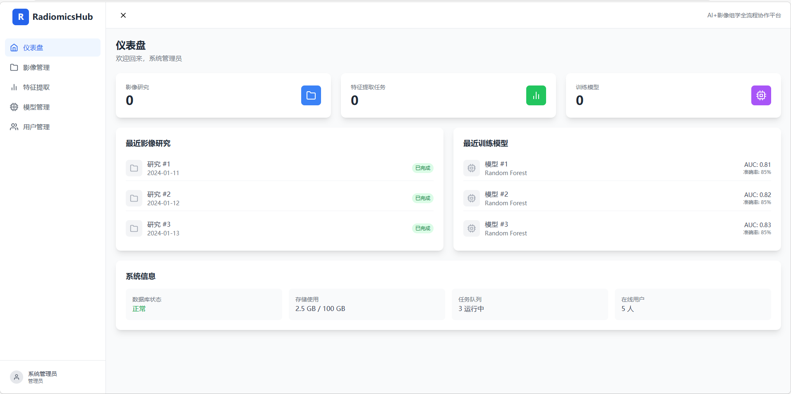
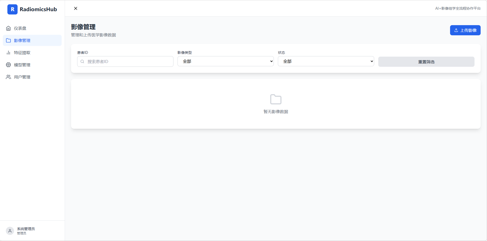
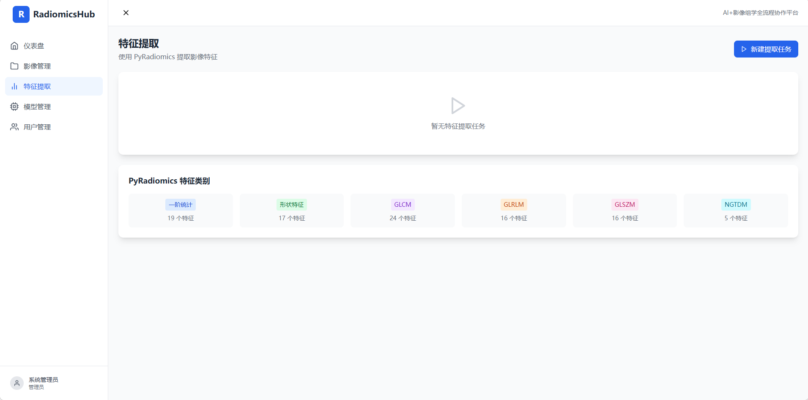
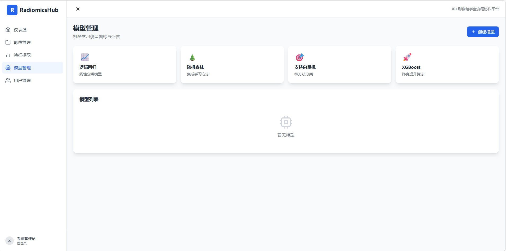
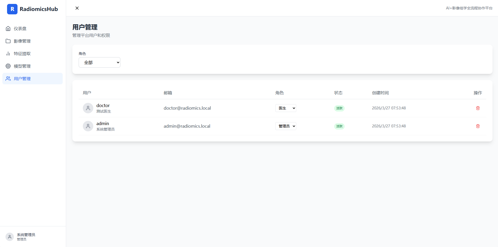

# RadiomicsHub - AI+影像组学全流程协作平台

<div align="center">

**AI+影像组学全流程协作平台**

支持多用户协作的医学影像标注、特征提取、机器学习建模全流程平台

[功能特性](#功能特性) • [快速开始](#快速开始) • [项目结构](#项目结构) • [API文档](#api文档)

</div>

---

## 功能特性

### 🔐 用户权限管理
- 多用户注册/登录系统
- 角色区分：管理员(Admin)、医生(Doctor)
- JWT Token 认证
- 完善的权限控制

### 📁 影像管理
- 支持格式：DICOM (.dcm)、NRRD (.nrrd)、NIfTI (.nii/.nii.gz)
- 批量上传功能
- 影像元数据自动解析
- 影像预览（2D切片、3D渲染）
- 影像归档与分类

### ✏️ 影像标注
- 类似 3D Slicer 的标注体验
- 支持多种标注工具：
  - 自由画笔
  - 多边形套索
  - 球体/立方体
  - 阈值分割
- ROI 自动保存
- 标注历史版本管理
- 多医生协作标注

### 📊 特征提取
- 集成 PyRadiomics 库
- 支持特征类别：
  - 一阶统计特征 (19个)
  - 形状特征 (17个)
  - 纹理特征 (GLCM, GLRLM, GLSZM, NGTDM)
- 特征参数可配置
- 批量特征提取
- 特征结果导出（CSV/Excel）

### 🤖 机器学习建模
- 多种模型支持：
  - 逻辑回归
  - 随机森林
  - 支持向量机
  - XGBoost
- 数据集划分与交叉验证
- 模型性能评估：
  - 准确率、敏感度、特异度
  - ROC曲线、AUC值
  - 混淆矩阵
  - 特征重要性排序
- 模型下载与部署

### 📈 可视化报告
- 模型性能可视化图表
- 特征重要性排序
- 预测结果展示

---

## 技术栈

### 后端
- **Python 3.11** - 编程语言
- **FastAPI** - 现代高性能 Web 框架
- **SQLAlchemy 2.0** - Python SQL 工具包和 ORM
- **PostgreSQL 15** - 关系型数据库
- **Redis 7** - 缓存和消息队列
- **Celery** - 分布式任务队列
- **MinIO** - S3 兼容对象存储
- **PyRadiomics** - 影像特征提取库
- **SimpleITK** - 医学影像处理
- **scikit-learn** - 机器学习库
- **XGBoost** - 梯度提升框架

### 前端
- **React 18** - UI 框架
- **TypeScript** - 类型安全
- **Vite** - 构建工具
- **TailwindCSS** - 样式框架
- **Zustand** - 状态管理
- **React Query** - 数据获取
- **Chart.js** - 数据可视化

### 基础设施
- **Docker** - 容器化
- **Docker Compose** - 容器编排
- **Nginx** - 反向代理

---

## 快速开始

### 前置要求

- Docker 24.0+
- Docker Compose 2.0+
- 8GB+ 可用内存
- 20GB+ 磁盘空间

### 一键启动

**Windows (PowerShell):**

```powershell
# 克隆项目
git clone https://github.com/your-username/radiomics-platform.git
cd radiomics-platform

# 启动服务
docker-compose up -d --build
```

**Linux/macOS:**

```bash
# 克隆项目
git clone https://github.com/your-username/radiomics-platform.git
cd radiomics-platform

# 启动服务
docker-compose up -d --build
```

### 前后端build大概需要30分钟+  提供docker hub直接下载,其他依赖在run的时候自动拉取
```bash
docker pull yangchen0513/radiomics-backend:20260327
docker pull yangchen0513/radiomics-frontend:20260327
```
### 访问地址

| 服务 | 地址 | 说明 |
|------|------|------|
| **前端界面** | http://localhost | React Web 应用 |
| **API 文档** | http://localhost:8000/docs | Swagger UI |
| **MinIO 控制台** | http://localhost:9001 | 对象存储管理 |

### 默认账号

| 角色 | 用户名 | 密码 |
|------|--------|------|
| 管理员 | admin | admin123 |
| 医生 | doctor | doctor123 |

---

## 项目结构

```
radiomics-platform/
├── docs/                      # 文档
│   ├── requirements.md        # 需求文档
│   └── architecture.md        # 架构文档
├── frontend/                  # 前端项目
│   ├── src/
│   │   ├── components/        # React 组件
│   │   ├── pages/             # 页面
│   │   ├── stores/            # 状态管理
│   │   ├── services/          # API 服务
│   │   └── types/             # TypeScript 类型
│   ├── package.json
│   └── Dockerfile
├── backend/                   # 后端项目
│   ├── app/
│   │   ├── api/v1/            # API 路由
│   │   ├── core/              # 核心配置
│   │   ├── models/            # 数据模型
│   │   ├── schemas/           # Pydantic 模式
│   │   ├── services/          # 业务逻辑
│   │   └── db/                # 数据库配置
│   ├── scripts/               # 脚本
│   ├── requirements.txt
│   └── Dockerfile
├── docker-compose.yml         # Docker 编排
└── README.md                  # 项目说明
```

---

## 使用文档

### 1. 上传影像（管理员）

1. 使用管理员账号登录
2. 进入「影像管理」页面
3. 点击「上传影像」按钮
4. 选择 DICOM/NRRD/NIfTI 文件
5. 等待系统处理完成

### 2. 标注 ROI（医生）

1. 进入「影像管理」页面
2. 点击影像列表中的标注按钮
3. 使用标注工具勾画感兴趣区域
4. 标注结果自动保存

### 3. 特征提取（管理员）

1. 进入「特征提取」页面
2. 点击「新建提取任务」
3. 选择要提取特征的研究
4. 配置特征参数
5. 等待提取完成
6. 导出特征结果

### 4. 模型训练（管理员）

1. 进入「模型管理」页面
2. 创建数据集
3. 创建模型并选择算法
4. 开始训练
5. 查看评估报告

---

## API 文档

启动服务后访问 http://localhost:8000/docs 查看完整的 API 文档。

### 主要端点

| 路径 | 方法 | 说明 |
|------|------|------|
| `/api/v1/auth/login` | POST | 用户登录 |
| `/api/v1/auth/register` | POST | 用户注册 |
| `/api/v1/users/` | GET | 用户列表 |
| `/api/v1/studies/` | GET/POST | 影像研究管理 |
| `/api/v1/studies/upload` | POST | 影像上传 |
| `/api/v1/annotations/rois` | GET/POST | 标注管理 |
| `/api/v1/features/extract` | POST | 特征提取 |
| `/api/v1/ml/models` | GET/POST | 模型管理 |

---

## 开发指南

### 后端开发

```bash
cd backend

# 创建虚拟环境
python -m venv venv
source venv/bin/activate  # Linux/macOS
# venv\Scripts\activate  # Windows

# 安装依赖
pip install -r requirements.txt

# 启动开发服务器
uvicorn app.main:app --reload --port 8000
```

### 前端开发

```bash
cd frontend

# 安装依赖
npm install

# 启动开发服务器
npm run dev
```

---

## 环境变量

在 `docker-compose.yml` 中已配置默认值，生产环境请修改：

```yaml
# 安全配置
SECRET_KEY: your-secret-key-change-in-production

# 数据库密码
POSTGRES_PASSWORD: your-db-password

# MinIO 凭证
MINIO_ROOT_USER: your-minio-user
MINIO_ROOT_PASSWORD: your-minio-password
```

---

## 常见问题

### 1. 端口被占用

修改 `docker-compose.yml` 中的端口映射：

```yaml
services:
  frontend:
    ports:
      - "8080:80"  # 改为 8080 端口
```

### 2. Docker 构建慢

在中国大陆，可以使用镜像加速器，或修改 Dockerfile 使用国内镜像源。

### 3. 内存不足

增加 Docker 可用内存：
- Windows: Docker Desktop → Settings → Resources → Memory
- Linux: 默认无限制

### 4. 数据库连接失败

等待 PostgreSQL 完全启动，通常需要 10-30 秒。可以查看日志：

```bash
docker-compose logs postgres
```

### 5. 重新初始化数据库

```bash
docker-compose down -v  # 删除数据卷
docker-compose up -d --build
```

---

## 许可证

MIT License

---

## 贡献指南

欢迎提交 Issue 和 Pull Request！

1. Fork 本仓库
2. 创建特性分支 (`git checkout -b feature/AmazingFeature`)
3. 提交更改 (`git commit -m 'Add some AmazingFeature'`)
4. 推送到分支 (`git push origin feature/AmazingFeature`)
5. 创建 Pull Request

---

<div align="center">

**⭐ 如果这个项目对你有帮助，请给一个 Star ⭐**

</div>















---

<div align="center">

**⭐ 如果这个项目对你有帮助，请给一个 Star ⭐**

</div>
